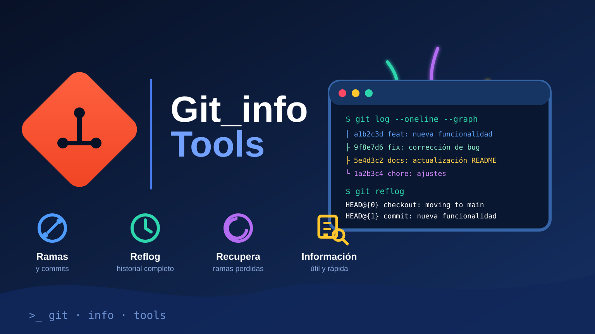

# Git Branch Info & Recovery

  

> Aplicación de escritorio para consultar ramas remotas de Git y sugerir la recuperación manual de referencias perdidas.

## Resumen

Aplicación de escritorio para consultar referencias de ramas remotas de un repositorio Git, buscar candidatos a ramas perdidas en el reflog local y guardar los resultados en una base SQLite. Versión del código: **V26.02.014**.

## Funciones

- Actualiza los remotos configurados y consulta las ramas de seguimiento del remoto predeterminado.
- Muestra el último commit de cada rama: hash, fecha, autor y mensaje.
- Calcula los ficheros modificados en ese commit y muestra hasta diez rutas.
- Analiza el reflog local para encontrar nombres y commits que podrían corresponder a ramas eliminadas.
- Guarda y actualiza los resultados en `git_branches.db`.
- Busca en los registros por nombre de rama, ruta del repositorio o fichero; incluye búsqueda por lotes de ramas o ficheros.
- Copia filas y exporta resultados a Excel.

## Recuperación: cómo funciona

La aplicación **no recrea ni cambia ramas automáticamente**. Para cada candidato encontrado en el reflog muestra los comandos `git branch` y `git checkout` que puedes revisar y ejecutar manualmente.

La detección depende de que el reflog y los objetos de commit sigan disponibles en el repositorio local. Un candidato es una sugerencia que conviene verificar antes de usar.

## Uso

Requisitos: Python 3.8 o posterior, Git instalado y disponible en el `PATH`, y Tkinter. Está preparado principalmente para uso de escritorio en Windows.

~~~powershell
python -m venv .venv
.\.venv\Scripts\Activate.ps1
python -m pip install -r requirements.txt
python main.py
~~~

También se puede usar `CreateEnv.bat`, pero **si ya existe, elimina y vuelve a crear la carpeta `.venv`**. Usa los comandos manuales si quieres conservar ese entorno.

## Qué ocurre al analizar un repositorio

La aplicación ejecuta un `fetch --prune` para cada remoto configurado y luego lista las referencias del remoto predeterminado. Esto necesita acceso de red y actualiza/prunea las referencias remotas locales obsoletas del repositorio analizado; no borra ramas del servidor remoto.

La base de datos `git_branches.db` se crea en el directorio de trabajo desde el que se inicia la aplicación. Mantiene una fila por repositorio, nombre y tipo de rama, y actualiza los datos del último commit detectado. No es un historial completo de todos los commits.

La base almacena rutas locales, nombres de rama, hashes, autores, mensajes y nombres de ficheros modificados. Revísala antes de compartirla.

## Dependencias principales

- GitPython para consultar Git y sus remotos.
- Tkinter para la interfaz gráfica.
- SQLite (`sqlite3`) para el registro local.
- openpyxl para exportar a Excel.

~~~
